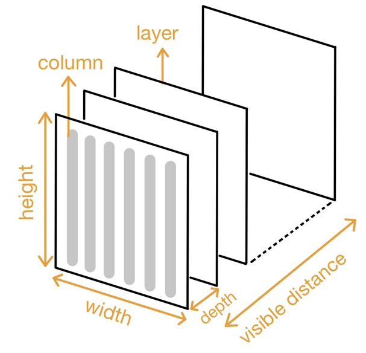

Voxel-Based Terrain Rendering
=============================

SUMMARY
-------

We implemented voxel-based terrain rendering using Perspective Projection, leveraging OpenMP for parallelism on the CPU and CUDA on the GPU. This method projects the 2D map into a first-person perspective. To evaluate performance, we compared a baseline sequential CPU implementation against five parallel implementations on both CPU and GPU, each employing different scheduling strategies and scenarios. In addition to presenting speedup plots for each implementation, we provide an analysis of the algorithm’s limitations and methods to overcome these limitations.

BACKGROUND
----------


**Key Data Structures:**

*   **Height Map heightMap:** A 2D array of size
MAP_SIZE x MAP_SIZE.
Stores the elevation data of the terrain for each
point in the grid and provides height values to
calculate the projected screen position of each
terrain point.
*   **Color Map colorMap:** AA 2D array of size
MAP_SIZE x MAP_SIZE.
Stores the RGB color data (0xRRGGBB) corresponding to each point in the grid and
supplies the color for the pixels on the screen corresponding to the terrain.
*   **Screen Buffer screen:** A 1D array of size WIDTH * HEIGHT.
Represents the output image where the rendered terrain is drawn. The final color is stored for each pixel.
*   **Hidden Buffer hidden:** A 1D array of size WIDTH.
Tracks the lowest visible height for each column of the screen during rendering. Used for occlusion handling, ensuring that farther terrain points do not overwrite closer ones.
*   **Depth Pixel (Added in Parallel version) depthPixel:** A custom structure to store the projected height of the point and the color of the column.
Facilitates parallel rendering by allowing depth layers to be processed separately and later merged into the screen buffer.


**Key Operations:**

1.   Depth Iteration: Iterates through depths from the front to the back, progressively rendering closer terrain points before farther ones.
2.   Column Iteration: Iterates vertical lines through the width from left to right of the screen.
3.   Transforms 3D terrain points to 2D screen coordinates, scaling the height based on the observer’s distance and perspective angle.
4.   Column Drawing: For each column, renders the terrain by filling pixels between the visible height and the previous height.

5.   Occlusion Handling: Compares the projected height of each terrain point with the current value in the hidden buffer and updates the screen and hidden to render only the visible terrain.


```cpp
void DrawFrontToBack(...) {
  for depthNum { // Depth Iteration
    for width { // Column Iteration
      // Perspective Projection
      for verticalPixel { // Column Drawing
        // Occlusion Handling
        screen[i] = color
      }
      updateHiddenValue()
    }
  }
}
```


**What are the algorithm’s inputs and outputs?**

* Inputs:   
    *   Height Map picture: Represents the terrain’s elevation data.
    *   Color Map picture: Provides the terrain’s surface colors.
    *   Rendering parameters: such as observer position, perspective angle, and depth.
*   Outputs:
    *   Screen: Contains the final rendered terrain image as a pixel buffer.
    *   PNG file (Optionally): The rendered image is saved as a PNG file to visualize results.

**What is the part that is computationally expensive and could benefit from parallelization?**

*   Column Iteration: Each column is rendered by processing all depths sequentially to ensure correct occlusion. This is computationally expensive, especially for large depth and the distance visible to the observer.
*   Perspective Projection: For each visible terrain segment, it involves multiple memory accesses and calculations, which can be optimized.

**Break down the workload. Where are the dependencies in the program? How much parallelism is there? Is it data-parallel? Where is the locality? Is it amenable to SIMD execution?**

**Dependencies:**

*   Column Iteration: Across columns drawing is independent, allowing parallelization at the column level.
*   Depth Iteration: Within columns is dependent, processing sequentially due to occlusion dependencies.

**Parallelism:**

*   Column Iteration: Parallel threads can process multiple columns simultaneously.
*   Depth Iteration: Perspective Projection: The operation to retrieve pixel data can be processed in parallel before starting to draw vertical lines.

**Locality:**

*   Spatial Locality: Perspective projection reads nearby pixels from heightmap and colormap. Screen rendering writes to nearby pixels/memory addresses to screen.
*   Temporal Locality: Successive depths within a column frequently update and check the hidden and screen.

**SIMD Suitability:**

*   Column Iteration: Similar pixel operations for filling vertical lines make it amenable to SIMD execution.
*   Perspective Projection: Operations on projecting a 2D map to a first-person perspective are uniform and can leverage SIMD instructions.


APPROACH
--------

**Technologies Used:**

**Language:** C++

**Machines:**

*   GHC Machine:
    *   CPU: Intel(R) Core(TM) i7-9700 8-Core 3.0GHz Processor
    *   GPU: NVIDIA RTX2080 2944 CUDA cores, Memory Bandwidth: 448 GB/s
*   PSC Machine:
    *   CPU: AMD EPYC 7742 64-Core 2.25GHz Processor (can access multiple nodes for more cores)
    *   GPU: NVIDIA TESLA V100 5120 CUDA cores, Memory Bandwidth: Up to 900 GB/s

We implemented six versions: one serial version, one CPU-based parallel version, and four
CUDA-based versions. The optimization process starts with the serial implementation,
progressively improving it, with each strategy building upon the previous version.

**CPU Parallel**

This version builds on the serial implementation by identifying parts of the logic that can
leverage OpenMP for parallelism. The optimization focuses on the screen rendering process.
Within each depth layer, OpenMP is used to parallelize the rendering of vertical lines in the
image. This approach enables parallel rendering of vertical sections, but the parallelism is
limited to the image width due to dependencies between vertical pixels.
#code
```cpp
void DrawFrontToBack(...) {
    for depthNum { // Depth Iteration
        #pragma omp parallel for
        for width { // Column Iteration
            // Perspective Projection
            for verticalPixel { // Column Drawing
            // Occlusion Handling
            screen[i] = color
            }
            updateHiddenValue()
        }
    }
}
```

**GPU Parallel**

* **LaunchKernelEveryDz:** 

    This code represents the initial implementation of GPU code. The parallelization mechanism
    is identical to that of the CPU portion. Within each depth layer, a GPU kernel is launched,
    enabling parallel rendering of each column.

* Configuration: Each block contains 256 threads and each thread processes on column of
the screen, computing its height and color and updating screen and hidden . The number
of blocks is calculated as ceil(WIDTH / threadsPerBlock), with the last block
processing fewer threads if the WIDTH can not be evenly divided. Every thread does
Perspective Projection, Column Drawing, Occlusion Handling, update hidden value(for
occlusion handling).

    * Memory Usage:
        * Global Memory on GPU: hightMap, colorMap, screen, hidden
        * Local Memory in block: no use
        * Each thread accesses specific locations in the heightmap and colormap based on its assigned column.
        * Global memory access is coalesced because threads access consecutive locations in these maps.

        ```cpp
        void DrawFrontToBack(...) {
            for depthNum { // Depth Iteration
                // launch kernal
                // ---------- in each thread ----------
                // Perspective Projection
                for verticalPixel { // Column Drawing
                    // Occlusion Handling
                    screen[i] = color
                }
                updateHiddenValue()
                // ------------------------------------
            }
        }
        ```

* **launchKernalOnce:** 

    This code represents an enhanced version of the launchKernalEveryDz version. Depth iteration is performed directly within the kernel. Previously, if depth iteration required multiple kernels, this could result in higher overhead from repeated kernel launches. Consolidating this logic into a single kernel reduces this overhead. The memory access for heightmap and colormap remains coalesced. However, reducing multiple kernel launches potentially improves cache utilization because all depth layers for a particular vertical line are processed by the same thread.

* **parallelDz:** 

    This version introduces a two-stage approach by separating projection and rendering, improving parallelism and memory reuse. Since previous CPU and GPU codes can be parallelized using only “width” number of threads due to dependencies. To exploit greater parallelism, the projection phase is separated from rendering. The perspective projection stage fully utilizes the GPU’s SIMD hardware to compute color and height data for each depth in parallel. The rendering stage then processes vertical column drawing and occlusion handling using “width” number of threads. This version of the terrain rendering implementation splits the rendering process into two distinct kernels:
    * Configuration:
        * CalculateDepthsKernel: Processes Perspective Projection, computing the height and color information for all depth layers at each horizontal position in parallel. Thread Grid is 2D grid. X-dimension handles the width of the screen; Y-dimension handles the depth layers. Each block contains 256 × 2 = 512 threads. The number of X blocks is ceil(WIDTH / threadsPerBlock.x) and of Y blocks is num_depths / threadsPerBlock.y .
        * MergeDepthsKernel: Processes Depth Iteration, Column Drawing, Occlusion Handling, update hidden value. Thread Grid is 1D grid. Each block contains 256 threads. The number of blocks is ceil(WIDTH / threadsPerBlock).
    * Memory Usage: Added depth_buffer to store height and color data for each depth. This buffer decouples the projection computation from the rendering process, allowing these two stages to be independently optimized.

    

    ```cpp
    void DrawFrontToBack(...) {
        // launch kernal
        // ---------- in each thread ----------
        // Perspective Projection
        // ------------------------------------
        // launch kernal
        // ---------- in each thread ----------
        for depthNum { // Depth Iteration
            for verticalPixel { // Column Drawing
                // Occlusion Handling
                screen[i] = color
            }
            updateHiddenValue()
        }
        // ------------------------------------
    }
    ```
* **Streaming:** 
This code is built upon parallelDz and uses streaming to increase GPU utilization. While
perspective projection can be computed parallelly for all depth iterations, drawing within a
column is dependent and parallelism is limited to the width of the output PNG file, leading to
most SMs being idle. Therefore, streaming is used for scheduling and pipelining the execution
of multiple images. Each image rendering pipeline will be put in a unique stream. The GPU
starts by launching 30(on PSC) streams/images to execute the perspective projection kernel.
At the synchronization point, the GPU checks for the frame that has finished the projection
work, and then it continues the corresponding stream number to execute the column drawing
task. The number of streams depends on how many images are rendered simultaneously.
Streaming implementation executes perspective projection and column drawing of different
images concurrently, increasing the utilization of SMs.

    

    ```cpp
    for(total_frames / N){
        DrawFrontToBack(...) {
            // create N streams, N = number of frames
            for N {
                cudaStreamCreate()
            }
            // launch N streams of Perspective Projection kernels
            // ---------- in each thread ----------
            // Perspective Projection
            // ------------------------------------
            // synchronize task according to frame number
            // launch N streams of Column Drawing kernels
            // ---------- in each thread ----------
            for depthNum { // Depth Iteration
                for verticalPixel { // Column Drawing
                    // Occlusion Handling: compare hidden value
                    screen[i] = color
                }
                updateHiddenValue()
            }
            // ------------------------------------
        }
    }
    ```

RESULTS
--------

* **Six Methods Performance**
    The general performance comparison across six different methods is based on a map size of
    1024 x 1024, a screen resolution of 700 x 512, a visible distance of 10,000 pixels, and a depth
    interval of 0.1f. The map size affects the resolution and detail of the terrain data, influencing
    memory usage and computational complexity. The screen size affects the rendering workload,
    particularly the number of columns to process and the number of threads required within each
    block. The ratio of visible distance to depth interval determines the number of depth iteration
    steps necessary for rendering the scene, significantly impacting the sequential workload and
    overall performance.

    | **GHC**        | serial | **cpu_parallel** | **gpu_launchKernelEveryDz** | **gpu_launchKernelOnce** | **gpu_parallelDz** | **gpu_streaming** |
    |-----------------|--------|------------------|----------------------------|--------------------------|--------------------|------------------|
    | **FPS**        | 2.99   | 7.03             | 9.45                       | 24.43                    | 29.49              | 82.19            |
    | **Speedup**    | 1.00   | 2.35             | 3.16                       | 8.17                     | 9.86               | 29.32            |

    The optimization goal for this project is to achieve a frame rate of at least 60 frames per second
    (FPS), as this is the industry standard for most modern games to ensure smooth and
    responsive gameplay, demonstrating its capability to perform under real-world gaming
    scenarios. Maintaining 60 FPS provides a visually fluid experience for users, reduces input
    lag, and meets the expectations set by contemporary gaming applications.

    The experimental results illustrate the performance improvements across six different methods
    for voxel-based terrain rendering, emphasizing the advancements achieved through
    parallelization and GPU optimization.
    * The serial implementation serves as the baseline, with no parallelization or GPU utilization.
    Its low FPS indicates the inefficiency of sequential computation for this workload.
    * The OpenMP for CPU parallelism approach significantly reduced computation time
    compared to the serial version by distributing the rendering process across the image’s
    columns.
    * The gpu_launchKernelEveryDz approach uses the GPU to process vertical lines parallelly
    for each depth layer. Due to GPU’s high thread count, it performs better than the CPU
    implementations. However, the frequent kernel launches result in overhead, limiting the
    speedup.
    * The gpu_launchKernalOnce approach, by reducing kernel launch overhead and
    processing all depth layers in a single kernel launch, achieves a dramatic performance
    boost compared to previous implementations.
    * The gpu_parallelDz approach calculates projections across depth layers in parallel first.
    It then draws screen columns in parallel. This method maximizes GPU utilization and
    reduces sequential dependencies, delivering near-real-time performance.
    * The streaming approach pipelines frame generation tasks using CUDA streams, ensuring
    efficient utilization of GPU resources. This method emphasizes leveraging parallelism
    while ensuring column drawing is processed sequentially to handle occlusion. The result
    surpasses the 60 FPS threshold, achieving exceptional performance suitable for real-time
    gaming scenarios.

* **Speedup Limitations**
The gpu_parallelDz implementation achieved 30 FPS but fell short of our target of 60 FPS.
Additionally, considering the thousands of available CUDA cores, a 10x speedup is not
particularly impressive. As the column-drawing stage is sequential and parallelism can only be
applied across columns, we used CUDA streams to compute multiple frames concurrently.
This approach preserves the sequential execution of column-drawing while maximizing
hardware resource utilization.
As the column-drawing stage is
sequential and parallelism can
only be applied across columns,
we implemented CUDA streams
to compute multiple frames
concurrently. This approach
preserves the sequential
execution of column-drawing
while maximizing hardware
resource utilization.


* **GHC vs PSC**

    | Methods            | serial | cpu_parallel | gpu_launchKernelEveryDz | gpu_launchKernelOnce | gpu_parallelDz | gpu_streaming |
    |---------------------|--------|--------------|--------------------------|----------------------|----------------|---------------|
    | **FPS GHC**        | 2.99   | 7.03         | 9.45                     | 24.43                | 29.49          | 82.19         |
    | **FPS PSC**        | 2.59   | 2.91         | 7.25                     | 15.92                | 23.36          | 214.29        |
    | **Time GHC**       | 21.4   | 9.1          | 6.77                     | 2.62                 | 2.17           | 0.73          |
    | **Time PSC**       | 24.72  | 22           | 8.83                     | 4.02                 | 2.74           | 0.28          |
    | **Speedup GHC**    | 1.00   | 2.35         | 3.16                     | 8.17                 | 9.86           | 29.32         |
    | **Speedup PSC**    | 1.00   | 1.12         | 2.80                     | 6.15                 | 9.02           | 88.29         |

    
    
    Comparing the performance of GHC and PSC, we observed several surprising results.
    * The GHC machine outperforms the PSC machine on serial implementation since GHC has a higher single-core clock speed.
    * When running CPU parallel code, the PSC machine performs slower than the GHC
    machine. Both machines were tested using 8 threads because the PSC machine
    experienced a performance drop at higher core counts, likely due to false sharing, as
    discussed in the “Multi-Core Comparison on PSC” section. However, even with the same
    core count, PSC underperforms compared to GHC. We attribute this to PSC’s lower clock
    speed, which increases the overhead of work distribution at lower core counts, leading to
    inefficiencies in the overall workload.
    * Every GPU implementation, except for the GPU streaming approach, shows that the PSC
    system performs slower than the GHC system. We attribute this to the lower clock speed
    of the Tesla V100 (1215 MHz) compared to the RTX 2080 (1515 MHz).
    In the gpu_launchKernelEveryDz, gpu_launchKernelOnce, and gpu_parallelDz
    implementations, performance is constrained by the sequential column-drawing
    component. While gpu_parallelDz fully parallelizes the perspective projection stage, the
    column-drawing phase accounts for over 90% of the total computation time. With such a
    sequential workload, the higher clock speed of the RTX 2080 allows it to outperform the
    Tesla V100.
    * The PSC system significantly outperforms the GHC system in the GPU streaming
    implementation. This advantage is not only due to the higher number of CUDA cores on
    the Tesla V100 but also its larger VRAM capacity. The increased VRAM enables more
    frames to be pipelined and processed in parallel, as detailed in the **Streaming Pipeline
    Analysis** section, which plays a major role in the PSC system’s superior performance.
    * Both the GHC and PSC machines achieve a baseline of 60 FPS. However, the PSC
    machine reaches up to 214 FPS, making it ideal for modern gaming monitors that support
    refresh rates of 120 Hz or even 240 Hz.


* **Multi - Core Comparison on PSC**

    | Number of Cores |  8   |  10  |  12  |  16  |  32  |  64  |
    |-----------------|------|------|------|------|------|------|
    | Time            |22.28 |23.29 |24.26 |38.71 |55.82 | 73.83|

    The results indicate a lack of performance
    scaling with an increasing number of CPU
    cores on the PSC system. Despite adding
    more cores, the execution time increases
    rather than decreases, which suggests
    false sharing is a likely cause.

    Using OpenMP for the terrain rendering
    algorithm, each thread is assigned to
    process a different column of the screen. Since columns are stored in a contiguous 1D array
    (screen buffer), consecutive threads operate on adjacent memory locations. Since threads
    process consecutive columns, adjacent threads frequently access memory locations that
    share the same cache line. This leads to false sharing, a performance bottleneck caused by
    multiple threads accessing different variables that reside in the same cache line.

    We believe this issue can be mitigated by using padding to ensure each thread writes to a
    unique cache line. However, this approach would consume significantly more memory and
    require merging the padded data back into the output screen array. As our primary focus is on
    GPU code rather than CPU OpenMP, we have limited our efforts to reporting and analyzing
    this interesting finding.

**Problem Variation**
* **Visible Distance**

    
    
    The number of depth iterations equals Visible
    Distance / Depth. Therefore, the decrease in
    Visible Distance should lead to speedup as both
    perspective projection and column drawing loops
    through all depth iterations for calculations.
    The table shows the speedup when the Visible
    Distance is 1000 pixels when compared to 10000 pixels. The result shows that the Visible
    Distance is a significant factor that contributes to the performance of the renderer.

* **Screen Size(Width)**

    
    
    Reducing the output screen width from 700
    pixels to 350 pixels resulted in a 2x speedup for
    the serial implementation, as the total
    computation was effectively halved.
    However, while both cpu_parallel and
    gpu_launchKernelEveryDz share similar
    implementation structures, a speedup was
    observed only in the cpu_parallel code. This is
    because the GHC CPU, with its 8 threads, distributes the 350 columns across its cores. In
    contrast, the RTX 2080, with 2944 CUDA threads, can distribute each column across all
    threads. Since the bottleneck of gpu_launchKernelEveryDz, gpu_launchKernelOnce, and
    gpu_parallelDz implementations are due to the sequential computation in the column drawing
    stage, speedup was not observed when reducing the screen width. In the gpu_streaming
    implementation, reducing the screen width decreases the computation required for the
    perspective projection stage. This reduction enables more frames to be processed in parallel,
    resulting in a slight speedup.

* **Screen Size(Height)**

    
    
    Reducing the output screen height from 512
    pixels to 256 pixels had no impact on
    performance across all implementations. This is
    because the height only affects the scaling of the
    image and the number of pixels to be drawn,
    without reducing the overall computational
    workload. As a result, performance remains
    unchanged.

REFERENCES
--------
* Voxel Space: [https://github.com/s-macke/VoxelSpace](https://github.com/s-macke/VoxelSpace)